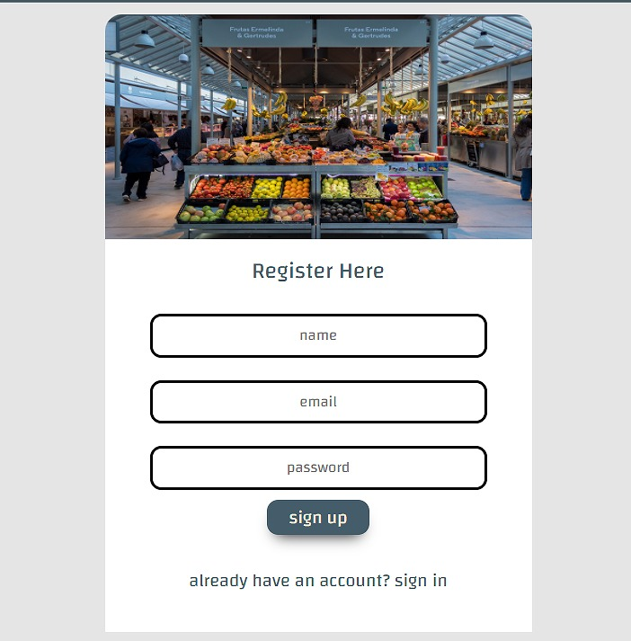
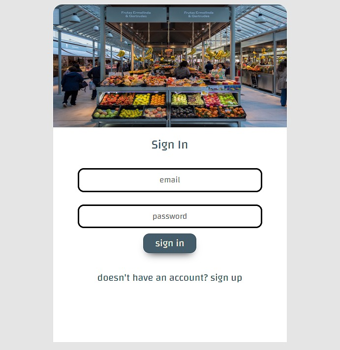
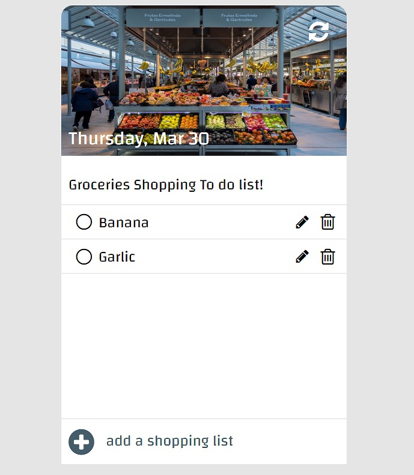

# Groceries Shopping List App

The grocery shopping list app is designed to help people easily create, manage, and track their grocery shopping lists. The app allows users to create a new list, add items to the list, mark items as completed once they've been purchased, and edit or delete items as needed.

In summary, the grocery shopping list app provides a convenient and easy-to-use way for users to create and manage their shopping lists, making grocery shopping faster and more efficient.

## Links

Here is the documentation [Documentation](https://documenter.getpostman.com/view/26683704/2s93RUuXat)

Here is the Web API link [GroceriesShoppingList](https://grocerieshop-list.netlify.app/)

## Pages

- Register Page
- Login Page
- Mainpage

## Screenshots

